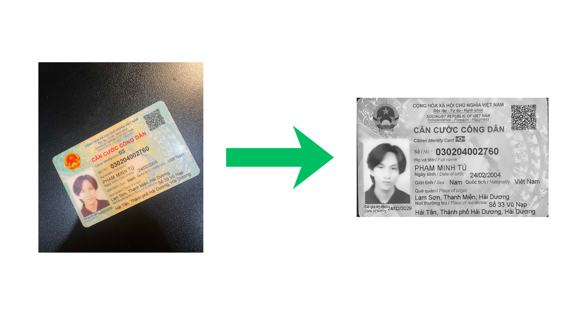
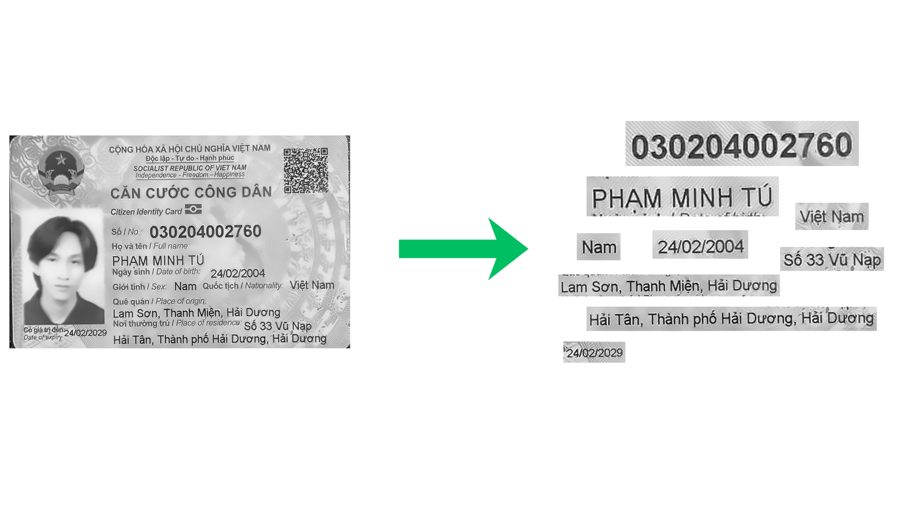

# Vietnamese ID CARD Recognition
A lightweight computer-vision pipeline for detecting Vietnamese ID cards and extracting key fields such as ID number, name, date of birth, and more. 
The system handles card detection, field localization, image alignment, enhancement, and OCR using VietOCR. Turn raw ID card photos into clean, structured, machine-readable data.


## Visualize how it works


---

## Example output
```json
{
  "success": true,
  "total_fields": 9,
  "timestamp": "2025-12-08T18:19:05.409878",
  "fields": {
    "id" :{
      "text" : "030204002760",
      "detection_confidence": 0.8612,
      "ocr_confidence": 0.9455
    },
    "current_place": {
      "text": "Hải Tân, Thành phố Hải Dương, Hải Dương",
      "detection_confidence": 0.6977,
      "ocr_confidence": 0.9158
    },
    "dob": {
      "text": "24/02/2004",
      "detection_confidence": 0.8086,
      "ocr_confidence": 0.9355
    },
    ...
  }
}
```

## 🚀 What This Project Does
- Detects the ID card region from an input image.
- Identifies text field locations (ID number, name, DOB, etc.).
- Preprocesses and aligns the card (rotation, cropping, enhancement).
- Uses VietOCR to recognize each field with high accuracy.
- Outputs structured JSON-like information extracted from the card.
- Designed as a modular, easily extendable pipeline.

---

## ✨ Key Features
- Card Detection: Localizes the ID card within the input image.
- Field Detection: Identifies regions corresponding to key text fields.
- Preprocessing: Alignment, cropping, denoising, and image enhancement.
- OCR Extraction: Uses VietOCR to read fields such as ID, name, DOB, address.
- Structured Output: Converts card images into clean, machine-readable text.
- Modular Design: Detector, preprocessor, OCR, and pipeline components separated clearly.

---

## 📦 Tech Stack
- Python
- OpenCV, Pillow
- VietOCR
- Ultralytics
- NumPy

---

## Getting started
### 1. Clone the repo
```sh
git clone https://github.com/pminhtu24/viID-Card-Recognition.git
cd viID-Card-Recognition
```
### 2. Create virtual env
```sh
python -m venv venv
source venv/bin/activate
```
OR using conda
```sh
conda create -n card_id_ocr python=3.10 --y
conda activate card_id_ocr
conda install pip          
```
## 3. Install dependencies
```sh
pip install -r requirements.txt
```

## 4. Run pipeline
```sh
python pipeline_v2.py
```
Output directory will be display in resulst/


## Optional
You can also run each module individually to verify that it works.

